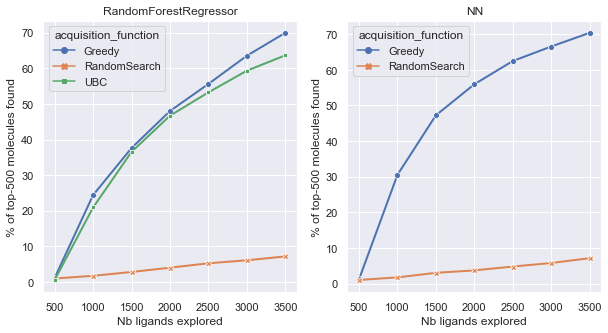

# aqemia_test

## Overview
To develop a new drug, we often need to screen larger and larger libraries to find the molecules with the highest affinity for a given protein. To deal with this issue, Bayesian optimization techniques can be used as an active learning strategy to explore the library in an optimized way.
The goal is to find in the fewest number of iterations the maximum of top-k scored molecules, thus reducing the computation power needed for screening large library.

This repository is a simple implementation of the method proposed in the paper [Accelerating high-throughput virtual screening through molecular pool-based active learning](https://arxiv.org/abs/2012.07127). This code was used with a given dataset of 50k molecules, Enamine 50k, where the docking score is already computed for every row.

## Requirements
- Python (>= 3.6)
- PyTorch (>= 1.8.1)

## Object Model

The structure of this code follow broadly what is describe in the paper.

**MoleculePool**: Class for managing a dataset of molecules. 

**Acquirer**: An acquirer is at the core of the active learning strategy. It uses a metric for selecting the next batch to add to the training.

**Model**: The model class contains different machine and deep learning models that are trained to predict to docking score. The hyperparameters used are the ones proposed in the reference paper.

**Network**: Contains the architecture of deep learning models in PyTorch.

## Pipeline

The main pipeline in the notebook "main.ipynb" train an active learning strategy for every combination of model and acquisition function that are implemented ( with the exception of the combination of UBC acquisition and Neural Network which is not yet implemented).
For every combination, the experiment is run 5 times, and each experiment excecutes 6 iteration.
The results are saved in a csv file in the folder data.
The second part of the notebook is for analyzing the results and compare the different approaches.

## Running the code

Add the csv file in the data folder. Open the notebook "main.ipynb" and modify if necessary the PATH variable of your csv file.
Eac
You can change the number of experiments that is computed for each combination of model and acquisition function.

## Results

We want to look at the percentage of top k molecules found after each iteration. This indicates how performant is our strategy to explore the dataset and finding quickly the best molecules that have the highest docking score.
Using the RandomSearch as a baseline, we can compare our different approaches.
Results show that the Greedy metric seems to perform slightly better that the Upper Bound Confidence metric, which is in line with what the research paper found.

Additionnaly, we computed the Enrichement Factor (EF) of each of those strategies. The EF is the % of top k molecules found at the last iteration, divided by the ones found with the random baseline.

|    EF   | Greedy | UBC |
|-------|------|------|
| NN |    10.6  |    Not implemented  |
|  Random Forest |    10.25  |   8.99   |

